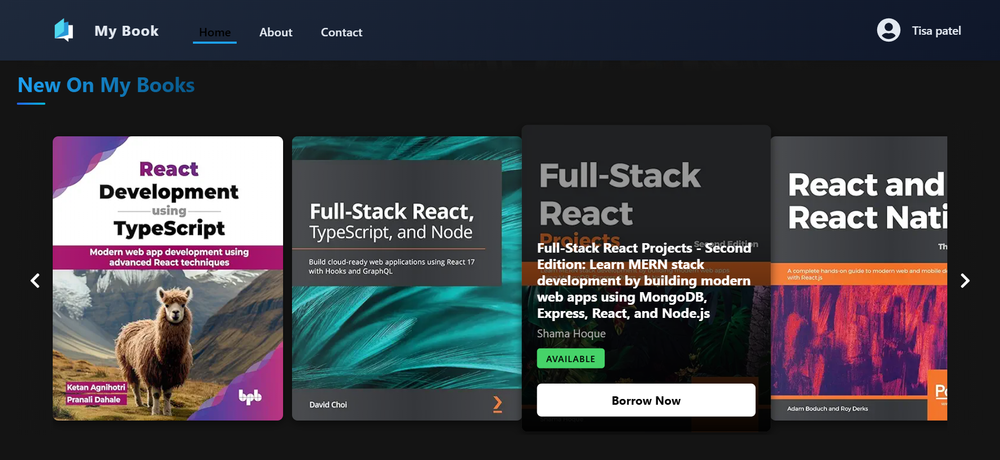
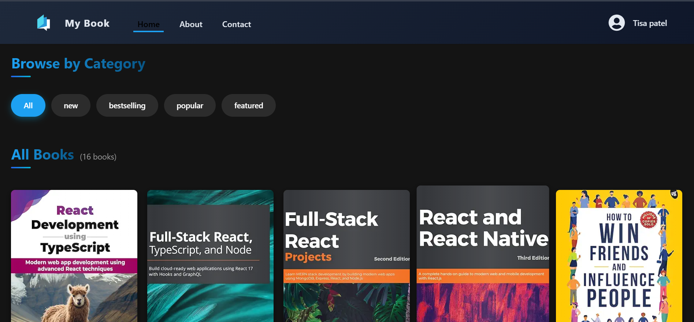

# Project Navigator 🚀

A modern **React + Vite** based web application built with a clean structure, smooth navigation, and scalable frontend architecture.
This project follows professional development standards and is ready for production deployment.

---

## ✨ Features

* ⚡ Fast development using **Vite**
* ⚛️ Built with **React 19**
* 🧭 Client-side routing using **React Router DOM**
* 🎨 Responsive UI with **Bootstrap 5**
* 🎯 Icons powered by **Lucide React** & **React Icons**
* 🧹 Code quality enforced using **ESLint**
* ☁️ Deployment-ready with **Vercel**

---

## 🛠️ Tech Stack

| Category   | Technology                |
| ---------- | ------------------------- |
| Frontend   | React 19                  |
| Build Tool | Vite                      |
| Styling    | Bootstrap 5               |
| Routing    | React Router DOM          |
| Icons      | Lucide React, React Icons |
| Linting    | ESLint                    |
| Deployment | Vercel                    |


---


📸 Screenshots
### 🏠 Home Page




---

## 📂 Project Structure

```
project-Navigator/
│
├── public/
├── src/
│   ├── components/
│   ├── pages/
│   ├── routes/
│   ├── assets/
│   ├── App.jsx
│   └── main.jsx
│
├── index.html
├── package.json
├── vite.config.js
├── vercel.json
└── README.md
```

---

## ⚙️ Installation & Setup

### 1️⃣ Clone the Repository

```bash
git clone https://github.com/Tisapatel/project-navigator.git
cd project-navigator
```

### 2️⃣ Install Dependencies

```bash
npm install
```

### 3️⃣ Start Development Server

```bash
npm run dev
```

Application will run at:

```
http://localhost:5173
```

---

## 🏗️ Build for Production

```bash
npm run build
```

Preview the build:

```bash
npm run preview
```

---

## 🚀 Deployment (Vercel)

This project is configured for **Vercel** using `vercel.json`.

Steps:

1. Push code to GitHub
2. Import repository in Vercel
3. Select **Vite** as framework
4. Deploy https://project-navigator-one.vercel.app/🚀

---

## 🧪 Available Scripts

| Command           | Description              |
| ----------------- | ------------------------ |
| `npm run dev`     | Run development server   |
| `npm run build`   | Build production app     |
| `npm run preview` | Preview production build |
| `npm run lint`    | Run ESLint               |

---

## 🔒 Environment Variables

No environment variables are required at the moment.
You can add a `.env` file later if needed.


---

## 🤝 Contributing

Contributions are welcome!

1. Fork the repository
2. Create a new branch
3. Commit your changes
4. Open a Pull Request

---


